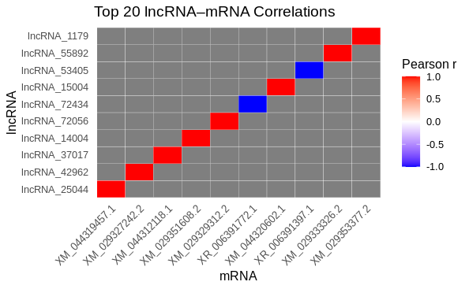

## 📊 lncRNA–mRNA Correlation Pipeline Summary

This pipeline takes raw lncRNA and mRNA count matrices, normalizes them with DESeq2, computes pairwise Pearson correlations, and exports + visualizes significant co-expression relationships. This run is for Acropora pulchra E5 samples from the original deep-dive. Code found [here](https://github.com/urol-e5/deep-dive-expression/blob/main/M-multi-species/code/03-expression-matrix-correlations.qmd).

### 🔧 Input

-   `lncRNA_counts.txt` — featureCounts output (6 metadata columns + counts)
-   `mRNA_counts.txt` — kallisto estimated counts (transcript ID + samples)

### 📤 Output

-   `correlations_full.tsv` — Pearson `r` values (lncRNAs × mRNAs)
-   `correlations_padj.tsv` — adjusted p-values (BH-corrected)
-   `significant_pairs.tsv` — pairs with \|r\| ≥ 0.7 and FDR ≤ 0.05

------------------------------------------------------------------------

### 🧩 Chunk-by-Chunk Breakdown

#### 1️⃣ Load Libraries

``` r
library(data.table)
library(DESeq2)
library(WGCNA)
library(bigmemory)
library(dplyr)
```

Loads packages for I/O, normalization, correlation, memory-efficient matrix storage, and tidy data manipulation.

------------------------------------------------------------------------

#### 2️⃣ Read Count Matrices & Format

-   Removes comment lines from `lncRNA_counts.txt`
-   Loads full kallisto table for mRNA
-   Removes blank/duplicate IDs
-   Converts to matrices with gene/transcript IDs as row names

``` r
# ---------- 2.0  Load the raw tables ---------------------------------------
lnc_raw  <- fread(cmd = "grep -v '^#' ~/github/deep-dive-expression/M-multi-species/data/03-expression-matrix-correlations/Apul/lncRNA_counts.txt")
mrna_raw <- fread("~/github/deep-dive-expression/M-multi-species/data/03-expression-matrix-correlations/Apul/mRNA_counts.txt")

# ---------- 2.1  Quick sanity counts *before* you touch rownames() ----------
cat("\nlnc_raw rows :", nrow(lnc_raw),
    "| unique Geneid :", length(unique(lnc_raw$Geneid)),
    "| blanks :", sum(lnc_raw$Geneid == ""), "\n")

cat("mrna_raw rows:", nrow(mrna_raw),
    "| unique IDs   :", length(unique(mrna_raw[[1]])),
    "| blanks :", sum(mrna_raw[[1]] == ""), "\n\n")

# ---------- 2.2  Drop blank IDs (if any) and make duplicates unique ---------
lnc_raw  <- lnc_raw [Geneid != ""]
mrna_raw <- mrna_raw[mrna_raw[[1]] != ""]

lnc_ids  <- make.unique(lnc_raw$Geneid)
mrna_ids <- make.unique(mrna_raw[[1]])

# ---------- 2.3  Build matrices with row-names that now *stick* -------------
lnc_mat <- as.matrix(as.data.frame(lnc_raw[, -(1:6)], row.names = lnc_ids))
mrna_mat <- as.matrix(as.data.frame(mrna_raw[, -1], row.names = mrna_ids))

# ---------- 2.4  Harmonise column (sample) names ----------------------------
clean_lnc <- function(x) sub(".*RNA-ACR-([0-9]+).*", "sample\\1", x)
colnames(lnc_mat)  <- clean_lnc(colnames(lnc_mat))
colnames(mrna_mat) <- sub("^kallisto_quant_", "", colnames(mrna_mat))
colnames(mrna_mat) <- sub("\\.\\d+$", "", colnames(mrna_mat))  # strip ".1"

# ---------- 2.5  Round Kallisto counts to integers -------------------------
mrna_mat <- round(mrna_mat)

# ---------- 2.6  Assign back to the workflow objects ------------------------
lnc_counts  <- lnc_mat
mrna_counts <- mrna_mat

head(lnc_counts)
head(mrna_counts)
```

------------------------------------------------------------------------

#### 2.1️⃣ Match Samples

Ensures both matrices have the same sample columns in the same order:

``` r
common <- intersect(colnames(lnc_counts), colnames(mrna_counts))
stopifnot(length(common) >= 2)
lnc_counts  <- lnc_counts [, common]
mrna_counts <- mrna_counts[, common]
```

------------------------------------------------------------------------

#### 3️⃣ Filter Low-Expression Genes

Keeps genes expressed at ≥10 counts in at least 3 samples:

``` r
min_samples <- 3
min_counts  <- 10
keep_lnc  <- rowSums(lnc_counts  >= min_counts) >= min_samples
keep_mrna <- rowSums(mrna_counts >= min_counts) >= min_samples
lnc_counts  <- lnc_counts [keep_lnc , ]
mrna_counts <- mrna_counts[keep_mrna, ]
```

------------------------------------------------------------------------

#### 4️⃣ Normalize & VST with DESeq2

-   Combines lncRNA + mRNA counts
-   Normalizes with `estimateSizeFactors()`
-   Applies variance-stabilizing transform (VST)
-   Splits matrix back into lncRNA and mRNA subsets

``` r
stopifnot(nrow(lnc_counts) == length(rownames(lnc_counts)))
stopifnot(nrow(mrna_counts) == length(rownames(mrna_counts)))

combined <- rbind(lnc_counts, mrna_counts)
dds <- DESeqDataSetFromMatrix(countData = combined,
                              colData = data.frame(cond = factor(rep("all", ncol(combined))),
                     row.names = colnames(combined)),
                              design    = ~ 1)

dds <- estimateSizeFactors(dds)
vst_mat <- assay(vst(dds, blind = TRUE))

lnc_vst  <- vst_mat[rownames(lnc_counts) , ]
mrna_vst <- vst_mat[rownames(mrna_counts), ]
```

------------------------------------------------------------------------

#### 5️⃣ Block-wise Pearson Correlations

-   Uses `big.matrix` to avoid memory issues
-   Computes Pearson `r` and p-values block by block
-   Adjusts p-values using BH

``` r
block_size <- 2000  # tweak for RAM
nr_lnc  <- nrow(lnc_vst)
nr_mrna <- nrow(mrna_vst)
cor_mat  <- big.matrix(nrow = nr_lnc, ncol = nr_mrna, type = "double")
cor_padj <- big.matrix(nrow = nr_lnc, ncol = nr_mrna, type = "double")

for (start in seq(1, nr_lnc, by = block_size)) {
  end <- min(start + block_size - 1, nr_lnc)
  rblk <- cor(t(lnc_vst[start:end, ]), t(mrna_vst), method = "pearson")
  pblk <- corPvalueStudent(rblk, nSamples = ncol(lnc_vst))
  cor_mat [start:end, ] <- rblk
  cor_padj[start:end, ] <- p.adjust(pblk, method = "BH")
  cat(sprintf("processed %d–%d\n", start, end))
}

options(bigmemory.allow.dimnames = TRUE)
dimnames(cor_mat)  <- list(rownames(lnc_vst),  rownames(mrna_vst))
dimnames(cor_padj) <- dimnames(cor_mat)
```

------------------------------------------------------------------------

#### 6️⃣ Export Results

-   Writes:
    -   Full `r` matrix
    -   Full `padj` matrix
    -   Filtered significant pairs (`|r| ≥ 0.7` & `padj ≤ 0.05`)

``` r
# full matrices (beware large size!)
fwrite(as.data.table(as.matrix(cor_mat),  keep.rownames = "lncRNA"), "~/github/deep-dive-expression/M-multi-species/output/03-expression-matrix-correlations/correlations_full.tsv")
fwrite(as.data.table(as.matrix(cor_padj), keep.rownames = "lncRNA"), "~/github/deep-dive-expression/M-multi-species/output/03-expression-matrix-correlations/correlations_padj.tsv")

# significant pairs (|r| ≥ 0.7 & padj ≤ 0.05)
sig <- which(abs(cor_mat[]) >= 0.7 & cor_padj[] <= 0.05, arr.ind = TRUE) |> as.data.frame()
colnames(sig) <- c("lnc_idx", "mrna_idx")
sig <- sig |>
  mutate(lncRNA = rownames(cor_mat)[lnc_idx],
         mRNA   = colnames(cor_mat)[mrna_idx],
         r      = cor_mat [cbind(lnc_idx, mrna_idx)],
         padj   = cor_padj[cbind(lnc_idx, mrna_idx)]) |>
  select(lncRNA, mRNA, r, padj)

fwrite(sig, "~/github/deep-dive-expression/M-multi-species/output/03-expression-matrix-correlations/significant_pairs.tsv")
```

------------------------------------------------------------------------

#### 7️⃣ Reproducibility

Captures session info:

``` r
sessionInfo()
```

------------------------------------------------------------------------

#### 8️⃣ Visualization

-   Selects top 20 most significant lncRNA–mRNA pairs
-   Reshapes data for plotting
-   Creates a heatmap using `ggplot2`

``` r
library(ggplot2)
library(reshape2)
library(tidyr)

# 1. Take top 20 by lowest padj
top_sig <- sig |> arrange(padj) |> head(20)

# 2. Create correlation matrix (wide form)
wide_df <- top_sig |> arrange(padj) |> head(20) |>
  select(lncRNA, mRNA, r) |>
  pivot_wider(names_from = mRNA, values_from = r)

heat_df <- as.data.frame(wide_df)
rownames(heat_df) <- heat_df$lncRNA
heat_df <- heat_df[, -1]

# 3. Melt into long format
heat_long <- melt(as.matrix(heat_df), varnames = c("lncRNA", "mRNA"), value.name = "correlation")

# 4. Plot
ggplot(heat_long, aes(x = mRNA, y = lncRNA, fill = correlation)) +
  geom_tile(color = "white") +
  scale_fill_gradient2(low = "blue", mid = "white", high = "red", midpoint = 0,
                       limits = c(-1, 1), name = "Pearson r") +
  theme_minimal(base_size = 12) +
  theme(axis.text.x = element_text(angle = 45, hjust = 1),
        panel.grid = element_blank()) +
  labs(title = "Top 20 lncRNA–mRNA Correlations",
       x = "mRNA", y = "lncRNA")
```



------------------------------------------------------------------------

### 🧠 Summary

This pipeline efficiently: - Normalizes RNA-seq count matrices - Computes millions of pairwise correlations - Filters and exports significant lncRNA–mRNA co-expression relationships - Visualizes the top signals in a clear, interpretable heatmap

------------------------------------------------------------------------

### Next steps

-   Check annotations for mRNA highly correlated with lncRNAs
-   Loosen adjusted p-value filtering to look at additional correlations
-   Run for Ptuh and Peve
